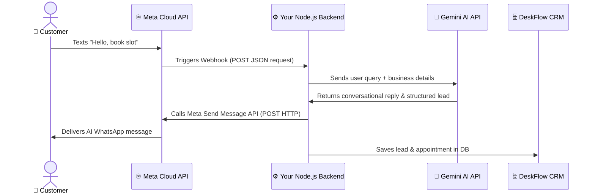

# DeskFlow AI: Real WhatsApp Business API Integration Guide

This guide explains how to connect your **DeskFlow AI** React frontend with a live backend server to communicate directly with real customers on WhatsApp using **Meta's official WhatsApp Business Cloud API**.

---

## 🏗️ Technical Architecture Flow

When a customer messages your WhatsApp Business number, the flow goes like this:



---

## 🛠️ Step 1: Meta Developer Portal Configuration

To get real API keys, you need to register on Meta's developer console:

1. **Create an App**:
   - Go to [Meta Developers Portal](https://developers.facebook.com/).
   - Click **Create App** > Choose **Business** category > Name it **DeskFlow AI**.
2. **Add WhatsApp to App**:
   - Scroll down on your app dashboard and click **Set up** next to **WhatsApp**.
3. **Get Temporary Credentials**:
   - You will see a **Temporary Access Token**, **Phone Number ID**, and **WhatsApp Business Account ID**. Copy these keys and save them in your DeskFlow Automation Hub.
   - *Note: For production, go to Business Settings > System Users to generate a **Permanent Access Token** that never expires.*

---

## ⚙️ Step 2: Implement the Node.js / Express Backend Server

To receive incoming WhatsApp messages, you need an active server with a public secure URL (`https://...`). 

Here is the complete production-ready backend code. Create a file named `server.js`:

```javascript
const express = require('express');
const axios = require('axios');
const app = express();

app.use(express.json());

// Load credentials from environment variables
const PORT = process.env.PORT || 3000;
const META_ACCESS_TOKEN = process.env.META_ACCESS_TOKEN; 
const PHONE_NUMBER_ID = process.env.PHONE_NUMBER_ID;
const VERIFY_TOKEN = 'deskflow_verify_token_secure_99'; // Matches your verify token

/**
 * 1. Webhook Verification (Required by Meta for setup check)
 */
app.get('/v1/webhooks/:niche', (req, res) => {
  const mode = req.query['hub.mode'];
  const token = req.query['hub.verify_token'];
  const challenge = req.query['hub.challenge'];

  if (mode === 'subscribe' && token === VERIFY_TOKEN) {
    console.log('Webhook verified successfully!');
    return res.status(200).send(challenge);
  } else {
    return res.sendStatus(403);
  }
});

/**
 * 2. Webhook Event Handler (Triggered when customer messages you)
 */
app.post('/v1/webhooks/:niche', async (req, res) => {
  try {
    const body = req.body;
    
    // Check if it's a message event
    if (body.object === 'whatsapp_business_account') {
      const entry = body.entry?.[0];
      const changes = entry?.changes?.[0];
      const value = changes?.value;
      const message = value?.messages?.[0];

      if (message && message.type === 'text') {
        const customerPhone = message.from; // e.g. "919900088000"
        const customerName = value.contacts?.[0]?.profile?.name || 'Customer';
        const userText = message.text.body;
        const niche = req.params.niche; // "dental" or "salon"

        console.log(`[${niche}] Received message from ${customerName} (${customerPhone}): ${userText}`);

        // A. Generate AI response (using your LLM endpoint)
        const aiResponse = await generateAIResponse(userText, customerName, niche);

        // B. Send response back to customer on WhatsApp
        await sendWhatsAppMessage(customerPhone, aiResponse);
        
        // C. (Optional) Parse leads/appointments from response and save to CRM DB
        await updateCRMDatabase(customerName, customerPhone, userText, aiResponse, niche);
      }
      return res.status(200).send('EVENT_RECEIVED');
    } else {
      return res.sendStatus(404);
    }
  } catch (err) {
    console.error('Webhook processing error:', err.message);
    return res.status(500).send('Webhook processing error');
  }
});

/**
 * 3. Meta Graph API Caller (Sends WhatsApp reply)
 */
async function sendWhatsAppMessage(toPhone, textBody) {
  const url = `https://graph.facebook.com/v21.0/${PHONE_NUMBER_ID}/messages`;
  
  const payload = {
    messaging_product: "whatsapp",
    recipient_type: "individual",
    to: toPhone,
    type: "text",
    text: {
      preview_url: false,
      body: textBody
    }
  };

  try {
    const response = await axios.post(url, payload, {
      headers: {
        'Authorization': `Bearer ${META_ACCESS_TOKEN}`,
        'Content-Type': 'application/json'
      }
    });
    console.log('Message sent successfully. Message ID:', response.data.messages[0].id);
  } catch (error) {
    console.error('Meta API Error:', error.response?.data || error.message);
  }
}

/**
 * 4. Simple Mock AI Handler (Replace with Gemini/OpenAI API Call)
 */
async function generateAIResponse(prompt, userName, niche) {
  // Integrate Google Gemini API here!
  if (niche === 'dental') {
    return `Hi ${userName}! 🦷 Thank you for contacting our clinic. I am your AI front desk. To secure your appointment, please reply with your preferred day and treatment!`;
  }
  return `Hello ${userName}! 💇‍♀️ Welcome to our Salon. How can I help you book your style session today?`;
}

async function updateCRMDatabase(name, phone, query, reply, niche) {
  // Write update code to save capture records inside your CRM database
}

app.listen(PORT, () => console.log(`DeskFlow Backend Server running on port ${PORT}`));
```

---

## 🌐 Step 3: Deploy and Expose Your Server (webhook connection)

Because Meta needs to send POST requests to a secure public URL (`https://...`), you cannot use `http://localhost:3000` directly. 

### Option A: Using ngrok (Perfect for local testing)
1. Download [ngrok](https://ngrok.com/).
2. Run your server local backend (`node server.js` on port `3000`).
3. Open a terminal and run:
   ```bash
   ngrok http 3000
   ```
4. Copy the secure Forwarding URL (e.g. `https://a1b2-cd34.ngrok-free.app`).
5. In your Meta developer dashboard:
   - **Callback URL**: `https://a1b2-cd34.ngrok-free.app/v1/webhooks/dental`
   - **Verify Token**: `deskflow_verify_token_secure_99`
6. Click **Verify and Save**. You are now live!

### Option B: Deploying to Cloud Production
Deploy the server code to an on-demand hosting service:
- **Render.com** (Free / extremely easy)
- **Railway.app**
- **Heroku**
Provide your `META_ACCESS_TOKEN` and `PHONE_NUMBER_ID` as environment variables on your host deployment console.

---

## 📢 Step 4: WhatsApp Message Templates (For Proactive Alerts)

Meta enforces strict rules for outbound notifications (like appointment reminders or referral discount cards) sent *outside* the 24-hour customer window:

1. You must submit a template for approval inside **Meta Developer Portal > WhatsApp > Message Templates**.
2. **Example Approved Template**:
   > *"Hi {{1}}, this is {{2}}. Your appointment for {{3}} is confirmed on {{4}}! We look forward to seeing you. Reply CANCEL to change."*
3. To trigger the reminder, call the API with the template payload:
   ```javascript
   const payload = {
     messaging_product: "whatsapp",
     to: toPhone,
     type: "template",
     template: {
       name: "appointment_confirmation",
       language: { code: "en_US" },
       components: [
         {
           type: "body",
           parameters: [
             { type: "text", text: "Amit Sen" },
             { type: "text", text: "Zenith Dental" },
             { type: "text", text: "Dental Implant" },
             { type: "text", text: "May 31st at 11:00 AM" }
           ]
         }
       ]
     }
   };
   ```
